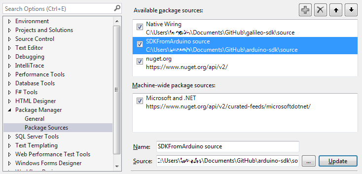
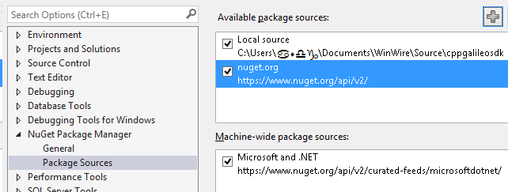

## Microsoft.IoT.Galileo.Arduino Nuget package
This repository is for generating the Windows Developer Program for IoT Nuget package. This package contains code which is compiled into the maker's application which can be deployed to a board running Microsoft Windows. 

This nuget package depends on Microsoft.IoT.SDKFromArduino, which contains source files written by the Arduino community. Together these packages ensure compatibility with existing sketches running on Microsoft Windows.

##Configure Visual Studio
You'll want to redirect visual studio's *user templates* to the repository you are working in.
*Tools -> Options*

Under *Projects and Solutions*, select *General*,

###For Visual Studio Pro and Ultimate

In order to install nuget packages from your local builds, you'll need to add both the galileo-sdk and arduino-sdk to the nuget package manager sources. Following the below instructions for each sdk source:

*Tools -> Library Package Manager -> Package Manager Settings*

1. Click the "+" button to add a new source
1. Set the name to something descriptive
1. Click the "..." button and navigate to your local sources directory (.\source folder)
1. Click the "Update" button to save the Package Sources changes

###For Visual Studio Express
*Tools -> Nuget Package Manager -> Package Manager Settings*

1. Click the "+" button to add a new source
1. Set the name to something descriptive
1. Click the "..." button and navigate to your local sources directory (.\source folder)
1. Click the "Update" button to save the Package Sources changes

##Build the Nuget package
Please download the Nuget command line utility [nuget.exe](http://nuget.org/nuget.exe) into the Galileo-SDK .\source folder.
Run the Nuget package builder from the .\source folder:


build-nupkg.cmd


##Building the Project
You can now goto *File -> New Project* then Select *Templates -> Visual C++ -> Galileo -> Galileo Wiring app*:

###Build the app
You can now build the application. Please refer to the [Hello Blinky Sample](HelloBlinky.htm) for details on how to build and deploy an application.

###Iterate in the Nuget Package
Now you need to make changes to the Nuget Package, you'll need to uninstall it first. Right click on the Project in the solution and select *Manage Nuget Packages*.

Now Uninstall the Galileo SDK by clicking the uninstall button. Selected yes, when prompted if you want to uninstall the arduino-sdk.

Then select *Online* and *Local Source*

###Install it!
Your updates will be there.

### Notes!
* While you can change your local headers, they will get nuked when reinstalling the nuget package.
* Don't check in your packages...
* Don't check in binaries