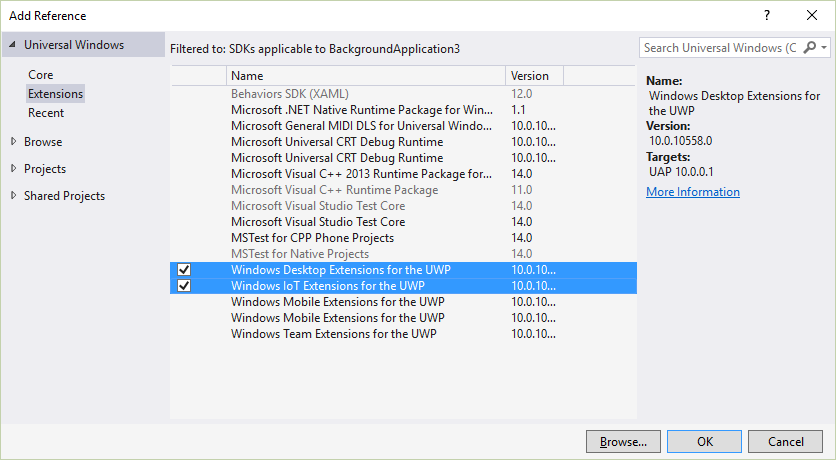

# **Microsoft.IoT.Lightning Nuget package**

This repository is for generating the Microsoft.IoT.Lightning Nuget package. This package contains code which is compiled into an application deployed to a board running Microsoft Windows IoT Core.

Also, the nuget package is periodically published to nuget.org. For more information on installing the published nuget package, please refer to [https://www.nuget.org/packages/Microsoft.IoT.Lightning/](https://www.nuget.org/packages/Microsoft.IoT.Lightning/)

This project has adopted the [Microsoft Open Source Code of Conduct](http://microsoft.github.io/codeofconduct). For more information see the [Code of Conduct FAQ](http://microsoft.github.io/codeofconduct/faq.md) or contact [opencode@microsoft.com](mailto:opencode@microsoft.com) with any additional questions or comments. 

## Build the Nuget package
- nuget.exe is required to build the Nuget package, so please download the Nuget command line utility [nuget.exe](http://nuget.org/nuget.exe) and make sure it's in the PATH. 
- Visual Studio 2017 is also required to build the sources ([Visual Studio Downloads](https://www.visualstudio.com/downloads/))
- Clone or download this repository
- Assuming F:\Github\lightning is your local repo root folder and all prerequisites above are met, run this command to both build the sources and create the Nuget package.

~~~
F:\Github\lightning>build.cmd
~~~

- Alternatively, if the sources are already built, run this command from the <root>\Nuget folder to create the Nuget package only.
  
~~~
F:\Github\lightning\Nuget>build-nupkg.cmd
~~~

### Set Nuget package source location

In order to install Nuget packages from your local builds, you'll need to add the folder where the Nuget package has been created (or copied) to the list of nuget package manager sources in Visual Studio. Following the below instructions for each sdk source:

In Visual Studio 2017, nativate to *Tools -> Library Package Manager -> Package Manager Settings*


1. Click the "+" button to add a new source
1. Set the name to something descriptive
1. Click the "..." button and navigate to your local folder where the Nuget package has been created; e.g. *F:\Github\lightning\Nuget*
1. Click the "Update" button to save the Package Sources changes

### Including prerelease Lightning packages

In order to install the latest prerelease version of Lightning as well as receive prerelease updates to the Lightning package, make sure to set the "Include prerelease" option in the Nuget Package Manager.


1. Right click References in your project
1. Click "Manager Nuget Packages..."
1. Select package sources for Lightning nuget
1. Click "Include prerelease".
1. Click "Install" to install the nuget package to your project

### Add required UWP Extensions

The IOT and Desktop UWP SDK Extensions are both required for building Lightning applications.



1. Right click "References" in your Visual C++ UWP Project
1. Choose "Add Reference..."
1. Open Universal Windows | Extensions
1. Choose Both "Windows Desktop Extensions for the UWP" and "Windows IoT Extensions for the UWP".

### Update Application Package manifest

Also, you need to update the Application Package manifest manually to reference the Lightning device interface.


1. Right click "Package.appxmanifest" in your Visual C++ UWP Project
2. Click "Open With.."
3. In the "Open With" dialog box, choose XML (Text) Editor and click OK
4. Edit the the Capabilities section in your application to add the following:
```XML
<iot:Capability Name="lowLevelDevices" />
<DeviceCapability Name="109b86ad-f53d-4b76-aa5f-821e2ddf2141"/>
```
5. The first is a capability that will enable the application to access custom devices.
6. The second is the device guid id for the Lightning interface
7. Save the file

Build your project to verify all prerequisites to use Lightning were successfully added.
